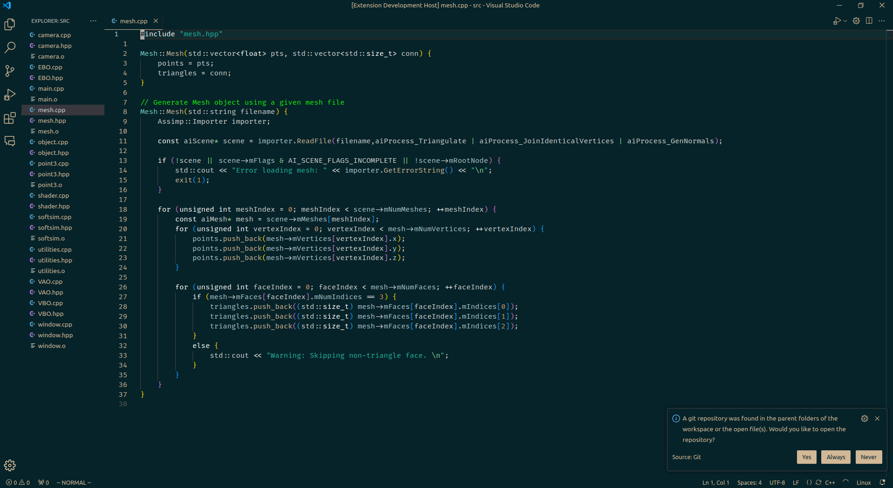

# 🙊 Naysayer Reloaded
Naysayer Reloaded is a VSCode colorscheme that is based on Jonathan Blow's Emacs [naysayer theme](https://youtu.be/HkVSTjWZXIU?t=3902), with some small modifications to make it more readable.



## Features
Simple theme, with very little additional changes unless necessary.

## Requirements
No requirements, install and enjoy!

## Extension Settings
- To change color of a UI element, use VSCode's `settings.json` and define `workBench.colorCustomizations` to change it.

### Docstring as Comments
For my own convenience, I have set Python's docstring to be displayed as comments. To do that, add the following lines to `settings.json`:
```json
"editor.tokenColorCustomizations": {
    "textMateRules": [
        {
            "scope": [
                "string.quoted.docstring.multi.python",
                "string.quoted.docstring.multi.python punctuation.definition.string.begin.python",
                "string.quoted.docstring.multi.python punctuation.definition.string.end.python"
            ],
            "settings": {
                "foreground": "#15ed05"
            }
        }
    ]
}
```

## Release Notes
### 1.0.0
Initial release.
